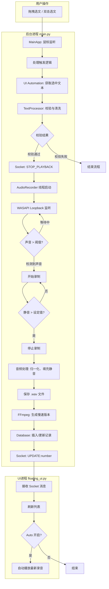

# EnREAD - 英语阅读辅助工具

一个 Windows 桌面语言学习辅助工具，后台静默监听用户操作，自动抓取选中的英文单词/句子并录制系统发音，配合悬浮窗口实现复习播放。数据通过 SQLite 数据库统一管理。

---

## 📁 项目文件结构

```jsx
EnREAD/
├── audio/                      # 音频文件保存目录（运行时生成）
├── tasks/                      # 任务记录目录
│
├── main.py                     # 后台主程序入口（鼠标监听、流程控制）
├── floating_ui.py              # 悬浮球主窗口模块
├── list_panel.py               # 录音列表面板模块
├── review_window.py            # 单词复习窗口模块（Leitner盒子系统）
├── word_game.py                # 单词拼句游戏模块
│
├── audio_player.py             # 音频播放控制器模块
├── audio_processor.py          # 音频处理模块（FFmpeg变速）
├── audio_recorder.py           # 音频录制模块（WASAPI Loopback）
│
├── db_manager.py               # 数据库管理模块
├── config_loader.py            # 配置加载模块
├── clipboard_manager.py        # 剪贴板管理模块
├── text_processor.py           # 文本处理模块
├── ui_services.py              # UI服务模块（Socket通信、一致性检查）
├── widgets.py                  # 通用UI组件模块
├── style_manager.py            # 样式管理模块
│
├── alt_trigger.py              # Alt键触发监听模块
├── ctrl_trigger.py             # Ctrl长按触发监听模块（OCR识别）
├── auto_record_trigger.py      # 自动补录触发模块
├── ui_automation.py            # UI自动化模块（获取光标文本）
│
├── config.ini                  # 配置文件
├── data.db                     # SQLite数据库文件（运行时生成）
├── review_window.qss           # 复习窗口QSS样式表
├── requirements.txt            # Python依赖库清单
├── start_app.bat               # 启动脚本
└── test_review.py              # 复习功能测试脚本
```

---

## 📦 模块职责说明

| 文件名 | 职责描述 |
| --- | --- |
| :--- | :--- |
| [**main.py**](http://main.py) | 程序的后台入口。负责全局鼠标监听（拖拽/双击触发），通过 UI Automation 获取选中文本，协调文本处理和录音流程的启动与停止。 |
| **floating_[ui.py](http://ui.py)** | 悬浮球主窗口。负责初始化数据库、一致性检查，管理悬浮球的显示、拖拽和面板展开动画。 |
| **list_[panel.py](http://panel.py)** | 录音列表面板。包含日期筛选、列表展示、播放模式切换、右键菜单，以及 Review 按钮入口。 |
| **review_[window.py](http://window.py)** | 单词复习窗口。实现 Leitner 盒子系统，提供「记得/不记得」交互，支持自动播放和 QSS 样式热重载。 |
| **word_[game.py](http://game.py)** | 单词拼句游戏窗口。将句子中的单词打乱后让用户重组还原，标点和数字固定在原位，支持窗口拖动。 |
| **audio_[player.py](http://player.py)** | 音频播放控制器。管理播放队列、播放模式（渐进式/重复式）和音频输出设备切换。 |
| **audio_[processor.py](http://processor.py)** | 音频后处理工具。调用 FFmpeg 生成慢速版本的音频文件（优先使用 rubberband 滤镜）。 |
| **audio_[recorder.py](http://recorder.py)** | 负责音频录制。使用 WASAPI Loopback 录制系统声音，包含静音检测、音频归一化、内容去重逻辑。 |
| **db_[manager.py](http://manager.py)** | 数据库抽象层。封装 SQLite 操作，管理录音记录的增删查改，包含 Leitner 盒子系统的查询和更新方法。 |
| **config_[loader.py](http://loader.py)** | 配置管理。负责读取 config.ini，提供类型安全的配置项访问属性，包含 Leitner 盒子间隔配置。 |
| **clipboard_[manager.py](http://manager.py)** | 剪贴板操作（已弃用）。原用于模拟 Ctrl+C 获取选中文本，现已替换为 UI Automation 方案。 |
| **text_[processor.py](http://processor.py)** | 文本清洗与校验。负责过滤非英文字符，校验文本长度和有效性，包含单词识别函数。 |
| **ui_[services.py](http://services.py)** | UI服务模块。包含 Socket 通信服务、启动时的一致性检查器和自动清理线程。 |
| [**widgets.py**](http://widgets.py) | 通用UI组件。包含 ToggleSwitch 开关、ClickableLabel 等可复用组件。 |
| **style_[manager.py](http://manager.py)** | 样式管理。负责加载 .qss 样式文件，支持 F5 热重载和缓存机制。 |
| **alt_[trigger.py](http://trigger.py)** | Alt键触发监听。按Alt键执行三击选中文本块，匹配数据库录音并播放，匹配失败时触发自动补录。 |
| **ctrl_[trigger.py](http://trigger.py)** | Ctrl长按触发。长按Ctrl键1秒后使用OCR识别鼠标位置的单词，自动录制TTS发音。采用边界框收缩策略精确定位单词。支持清洗首尾标点、引号、下划线。 |
| **auto_record_[trigger.py](http://trigger.py)** | 自动补录触发。使用OCR搜索TTS软件的「朗」按钮并点击，直接创建AudioRecorder录音。 |
| 类/函数 | 说明 |
| :--- | :--- |
| `get_selected_text()` | 使用 TextPattern 获取用户选中的文本（主要方法） |
| `get_text_at_cursor()` | 获取鼠标位置下的 UI 元素文本（Alt 键触发使用） |
| `_try_get_selection_from_element()` | 从元素或其父元素获取选中文本（内部方法） |

---

## 🔧 核心类与函数清单

### [main.py](http://main.py)

| 类/函数 | 说明 |
| --- | --- |
| :--- | :--- |
| `MainApp` | 主应用类，管理鼠标监听和录音流程 |
| `MainApp.on_click()` | 鼠标点击回调，检测拖拽和双击事件 |
| `MainApp.handle_trigger()` | 触发处理流程（停止旧任务，启动新流程） |
| [`MainApp.run](http://MainApp.run)_process_flow()` | 核心工作流：UI Automation 获取选中文本 → 文本校验 → 停止播放 → 启动录音 |
| `ExitServer` | 监听 socket 端口，接收退出信号以关闭后台进程 |

### audio_[recorder.py](http://recorder.py)

| 类/函数 | 说明 |
| --- | --- |
| :--- | :--- |
| `AudioRecorder` | 录音线程类（继承 Thread） |
| `get_loopback_mic()` | 获取系统默认扬声器的 Loopback 设备 |
| `run()` | 执行录音循环，计算 RMS dB 值进行静音检测 |
| `save_file()` | 录音结束后的处理（归一化、填充静音）和保存 |
| `_initialize_word_review_fields()` | 初始化单词的复习相关字段（Leitner系统） |
| `notify_ui()` | 通过 Socket 通知 UI 刷新列表并自动播放 |

### audio_[processor.py](http://processor.py)

| 类/函数 | 说明 |
| --- | --- |
| :--- | :--- |
| `generate_slow_audio()` | 调用系统 FFmpeg 生成指定倍速的音频文件 |

### audio_[player.py](http://player.py)

| 类/函数 | 说明 |
| --- | --- |
| :--- | :--- |
| `AudioPlayer` | 音频播放控制器（继承 QObject） |
| `play()` | 播放指定录音，支持清空或追加队列 |
| `auto_play()` | 录音完成后的自动播放处理 |
| `_get_sequence_for_number()` | 根据播放模式生成播放文件序列 |
| `play_next_in_queue()` | 播放队列中的下一个文件 |

### floating_[ui.py](http://ui.py)

| 类/函数 | 说明 |
| --- | --- |
| :--- | :--- |
| `FloatingBall` | 悬浮球主窗口，负责初始化数据库、启动 Socket 服务和一致性检查 |
| `expand_panel()` | 展开列表面板（带动画） |
| `collapse_panel()` | 收起列表面板（带动画） |

### list_[panel.py](http://panel.py)

| 类/函数 | 说明 |
| --- | --- |
| :--- | :--- |
| `ListPanel` | 录音列表面板，包含日期筛选、列表展示和 Review 按钮入口 |
| `ModeSelector` | 播放模式选择器（Mode1/Mode2、循环次数、Auto开关） |
| `AudioListItem` | 单个录音项组件，包含播放按钮和右键菜单 |
| `DateFilterComboBox` | 自定义日期筛选下拉框 |

### review_[window.py](http://window.py)

| 类/函数 | 说明 |
| --- | --- |
| :--- | :--- |
| `ReviewWindow` | 单词复习窗口，实现 Leitner 盒子系统 |
| `on_remember()` / `on_forget()` | 处理「记得」/「不记得」按钮点击 |
| `_load_words_to_review()` | 从数据库加载待复习单词列表 |
| `on_new_word_added()` | 新单词加入时刷新列表并触发高亮动画 |
| `ReviewToggleSwitch` | 复习窗口专用的 Toggle 开关（自定义颜色） |

### word_[game.py](http://game.py)

| 类/函数 | 说明 |
| --- | --- |
| :--- | :--- |
| `WordGameWindow` | 单词拼句游戏窗口，支持标题栏拖动 |
| `FlowLayout` | 自适应流式布局（用于单词按钮排列） |
| `tokenize()` | 将句子分词为 token 列表 |
| `classify_tokens()` | 将 token 分类为可选词和固定项（标点/数字） |
| `build_target_area()` | 构建已选区显示（固定项 + 占位符 + 已选单词） |
| `check_result()` | 验证用户还原的单词顺序是否正确 |

### db_[manager.py](http://manager.py)

| 类/函数 | 说明 |
| --- | --- |
| :--- | :--- |
| `DatabaseManager` | 数据库管理类 |
| `init_db()` | 初始化数据库表结构 |
| `insert_recording()` | 插入新录音记录 |
| `get_recordings_by_date()` | 按日期查询录音 |
| `delete_recording()` | 删除录音记录 |
| `migrate_add_review_fields()` | 迁移方法，添加 Leitner 盒子系统所需字段 |
| `get_words_to_review()` | 获取待复习的单词列表 |
| `update_word_box()` | 更新单词的复习状态 |
| `get_review_stats()` | 获取复习统计信息 |
| `get_recording_by_content()` | 根据内容查询记录（用于去重） |

### text_[processor.py](http://processor.py)

| 类/函数 | 说明 |
| --- | --- |
| :--- | :--- |
| `clean_text()` | 清洗文本，过滤非ASCII字符 |
| `validate_text()` | 校验文本有效性（非空、长度≤600） |
| `process_text()` | 文本处理主函数 |
| `is_valid_word()` | 判断文本是否为合法英文单词 |

### ui_[services.py](http://services.py)

| 类/函数 | 说明 |
| --- | --- |
| :--- | :--- |
| `CommandServer` | Socket 服务器，处理进程间通信 |
| `ConsistencyChecker` | 启动时检查数据库记录与磁盘文件的一致性 |
| `FileCleaner` | 自动清理超期录音的线程 |

### [widgets.py](http://widgets.py)

| 类/函数 | 说明 |
| --- | --- |
| :--- | :--- |
| `ToggleSwitch` | 自定义 Toggle 开关组件（带动画） |
| `ClickableLabel` | 可点击的标签组件 |

### style_[manager.py](http://manager.py)

| 类/函数 | 说明 |
| --- | --- |
| :--- | :--- |
| `StyleManager` | QSS 样式表管理器 |
| `load_stylesheet()` | 加载样式文件（支持缓存） |
| `reload_stylesheet()` | 强制重新加载样式（用于热更新） |

---

## ⚙️ config.ini 配置参数说明

### [Audio] - 录音设置

| 参数 | 默认值 | 说明 |
| --- | --- | --- |
| :--- | :--- | :--- |
| `start_silence_duration` | 6.0 | 开始录音前允许的最大静音时长（秒），超时则放弃 |
| `max_recording_duration` | 30.0 | 最大录音时长（秒） |
| `silence_threshold_db` | -40.0 | 静音阈值（dB），低于此值视为静音 |
| `end_silence_duration` | 1.5 | 录音过程中，持续静音多少秒后自动停止 |

### [Paths] - 路径设置

| 参数 | 默认值 | 说明 |
| --- | --- | --- |
| :--- | :--- | :--- |
| `save_dir` | audio | 音频文件保存目录 |

### [Database] - 数据库设置

| 参数 | 默认值 | 说明 |
| --- | --- | --- |
| :--- | :--- | :--- |
| `db_path` | data.db | 数据库文件路径 |
| `wal_mode` | True | 是否开启 WAL 模式（提高并发性能） |
| `busy_timeout` | 30000 | 数据库繁忙超时时间（毫秒） |
| `retry_count` | 3 | 写操作失败时的重试次数 |

### [UI] - 界面基础设置

| 参数 | 默认值 | 说明 |
| --- | --- | --- |
| :--- | :--- | :--- |
| `ball_diameter` | 45 | 悬浮球直径（像素） |
| `panel_width` | 290 | 列表面板宽度 |
| `panel_max_height` | 400 | 列表面板最大高度 |
| `opacity` | 0.9 | 窗口透明度 |
| `font_size` | 15 | 基础字体大小 |
| `refresh_interval` | 2000 | 列表自动刷新间隔（毫秒） |
| `last_position` | - | 悬浮球上次退出时的位置 |
| `animation_duration` | 250 | 面板展开/收起动画时长（毫秒） |
| `max_filename_chars` | 22 | 列表项文本最大显示字符数 |

### [PlayMode] - 播放模式

| 参数 | 默认值 | 说明 |
| --- | --- | --- |
| :--- | :--- | :--- |
| `last_mode` | mode2 | 上次使用的播放模式（mode1/mode2） |
| `mode2_loop_count` | 3 | Mode2 下的单曲循环次数（3/5/7） |
| `auto_enabled` | False | 是否开启录音完成后自动播放 |

### [SlowAudio] - 慢速音频

| 参数 | 默认值 | 说明 |
| --- | --- | --- |
| :--- | :--- | :--- |
| `generate_slow_versions` | True | 是否生成慢速版本 |
| `slow_speeds` | 0.5, 0.75 | 需要生成的慢速倍率列表 |

### [WordGame] - 单词游戏

| 参数 | 默认值 | 说明 |
| --- | --- | --- |
| :--- | :--- | :--- |
| `min_text_length` | 30 | 触发游戏功能的最小文本长度 |
| `game_window_width` | 550 | 游戏窗口宽度 |
| `game_window_height` | 650 | 游戏窗口高度 |
| `min_word_count` | 2 | 最少可选单词数量，少于此数无法进行游戏 |

### [ReviewWindow] - 复习窗口

| 参数 | 默认值 | 说明 |
| --- | --- | --- |
| :--- | :--- | :--- |
| `opacity` | 0.95 | 窗口透明度 |
| `font_size` | 18 | 基础字体大小 |
| `auto_play_delay` | 1.0 | 自动播放延迟（秒） |
| `max_word_length` | 35 | 合法单词的最大长度 |
| `box_1_interval` | 1 | Leitner 盒子1的复习间隔（天） |
| `box_2_interval` | 2 | Leitner 盒子2的复习间隔（天） |
| `box_3_interval` | 4 | Leitner 盒子3的复习间隔（天） |
| `box_4_interval` | 7 | Leitner 盒子4的复习间隔（天） |
| `box_5_interval` | 14 | Leitner 盒子5的复习间隔（天） |

### [Cleanup] - 自动清理

| 参数 | 默认值 | 说明 |
| --- | --- | --- |
| :--- | :--- | :--- |
| `cleanup_delay_seconds` | 60 | 启动后延迟执行清理的时间（秒） |

### [CtrlTrigger] - Ctrl长按触发

| 参数 | 默认值 | 说明 |
| --- | --- | --- |
| :--- | :--- | :--- |
| `enabled` | true | 是否启用 Ctrl 长按触发功能 |
| `hold_duration` | 1.0 | Ctrl 长按时长阈值（秒），达到后立即启动（不等释放） |
| `sound_detect_timeout` | 2.0 | 等待系统声音的超时时间（秒） |
| `duplicate_play_delay` | 0.3 | 重复文本时，TTS 结束后的播放延迟（秒） |

### [AltTrigger] - Alt键触发

| 参数 | 默认值 | 说明 |
| --- | --- | --- |
| :--- | :--- | :--- |
| `trigger_key` | alt | 触发键，可选值: alt, ctrl, shift |
| `enable_triple_click` | true | 鼠标左键三连击触发功能开关 |
| `triple_click_interval` | 0.05 | 三击之间的间隔时间（秒） |
| `wait_after_triple_click` | 0.15 | 三击后等待时间（秒），等待文本选中完成 |
| `debounce_interval` | 0.5 | 触发键防抖动间隔（秒） |
| `play_count` | 1 | 匹配成功后的播放次数 |

### [AutoRecord] - 自动补录

| 参数 | 默认值 | 说明 |
| --- | --- | --- |
| :--- | :--- | :--- |
| `wait_for_toolbar` | 0.5 | 悬浮横条出现等待时间（秒） |
| `ocr_search_offset_y` | 80 | OCR搜索区域上方偏移（像素） |
| `ocr_search_width` | 320 | OCR搜索区域宽度（像素） |
| `follow_main_autoplay` | false | 录音完成后是否跟随主界面自动播放设置 |

### [DateFilter] - 日期筛选

| 参数 | 默认值 | 说明 |
| --- | --- | --- |
| :--- | :--- | :--- |
| `max_display_dates` | 15 | 最多显示/保留的日期数量 |
| `empty_list_hint_text` | 今天没有录音 | 空列表提示文字 |

---

## 🔄 程序主要工作流程



---

## 📚 依赖库清单 (requirements.txt)

| 库名 | 用途 |
| --- | --- |
| :--- | :--- |
| `pynput` | 监听鼠标事件和模拟键盘按键 |
| `pyperclip` | 跨平台的剪贴板读写操作 |
| `soundcard` | 音频录制（支持 WASAPI Loopback） |
| `soundfile` | 读写 WAV 音频文件 |
| `numpy` | 音频数据处理（RMS 计算、归一化、数组拼接） |
| `pywin32` | Windows API 访问（soundcard 依赖） |
| `PyQt6` | 构建图形用户界面 |
| `comtypes` | Windows UI Automation API 访问 |
| `winocr` | Windows 原生 OCR（用于自动补录） |
| `pyautogui` | 鼠标点击和位置获取 |
| `Pillow` | 屏幕截图（winocr 依赖） |

**安装命令：**

```bash
pip install -r requirements.txt
```

**额外依赖：**

- **FFmpeg**：需要系统安装并添加到 PATH 环境变量，用于生成变速音频

---

## 🛠️ 技术实现细节

### 1. WASAPI Loopback 录音

- 使用 `soundcard` 库获取默认扬声器的 Loopback 设备，从而录制系统内部发出的声音（如 TTS 发音），而非麦克风声音
- 通过计算音频块的 **RMS（均方根）** 并转换为 **dB 值** 来实现基于阈值的静音检测
- 录音参数：采样率 48000Hz，双声道，块大小 4800 帧

```python
# 静音检测核心逻辑
rms = np.sqrt(np.mean(data**2))
db = 20 * np.log10(rms + 1e-9)
if db > silence_threshold_db:
    # 检测到声音
```

### 2. FFmpeg 变速处理

- 调用系统安装的 `ffmpeg` 命令行工具
- **优先尝试 `rubberband` 滤镜**（音质更好，保持音调不变）
- 如果失败则**回退到 `atempo` 滤镜**（标准方案）
- 生成的文件名格式为 `{number}@{speed}.wav`

```python
# Rubberband 滤镜（高质量）
cmd = [ffmpeg_cmd, '-y', '-v', 'error', '-i', input_path,
       '-af', f'rubberband=tempo={speed}', output_path]

# Atempo 滤镜（回退方案）
cmd = [ffmpeg_cmd, '-y', '-v', 'error', '-i', input_path,
       '-af', f'atempo={speed}', output_path]
```

### 3. UI Automation 获取选中文本

- 使用 Windows UI Automation 的 **TextPattern** 接口直接获取用户选中的文本
- **完全不触碰剪贴板**，彻底避免与用户正常复制操作的冲突
- 支持双击选词和拖拽选句两种场景
- 三重回退策略：焦点元素 → 鼠标位置元素 → 前台窗口

```python
# 核心原理
text_pattern = element.GetCurrentPattern(UIA_TextPatternId)
selection = text_pattern.GetSelection()
text = selection.GetElement(0).GetText(-1)
```

### 4. 双进程架构

| 进程 | 职责 | 入口文件 |
| --- | --- | --- |
| :--- | :--- | :--- |
| **后台进程** | 输入监听、录音任务 | [main.py](http://main.py) |
| **UI 进程** | 界面展示、播放控制 | floating_[ui.py](http://ui.py) |

**进程间通信（IPC）：**

| Socket 端口 | Server | Client | 用途 |
| --- | --- | --- | --- |
| :--- | :--- | :--- | :--- |
| 65432 | UI 进程 | 后台进程 | 录音完成通知、停止播放指令 |
| 65433 | 后台进程 | UI 进程 | 退出指令 |

### 5. 数据一致性维护

- UI 启动时运行 `ConsistencyChecker`，比对数据库记录和磁盘上的 `.wav` 文件
- 自动删除没有对应文件的数据库记录
- 自动删除没有对应数据库记录的孤儿文件
- 自动清理已废弃的 `text/` 文件夹

### 6. 内容去重机制

- 录音保存前检查数据库中是否已存在相同内容的记录
- 如果存在，则覆盖旧录音（删除旧音频文件，更新日期字段）
- 如果不存在，则插入新记录

### 7. Leitner 盒子复习系统

- 单词被分配到 1-5 级盒子中
- 每个盒子有不同的复习间隔（1/2/4/7/14 天）
- 「记得」→ 盒子等级 +1，复习间隔增加
- 「不记得」→ 盒子等级重置为 1
- 仅对合法英文单词（无空格、长度≤35）启用复习系统

### 8. 音频文件命名规则

基于数据库 `number` 字段的纯数字命名：

| 版本 | 文件名格式 | 示例（number=42） |
| --- | --- | --- |
| :--- | :--- | :--- |
| 1x（原速） | `{number}.wav` | `42.wav` |
| 0.75x | `{number}@0.75.wav` | `42@0.75.wav` |
| 0.5x | `{number}@0.5.wav` | `42@0.5.wav` |

### 9. 播放模式

| 模式 | 行为 |
| --- | --- |
| :--- | :--- |
| **Mode1（渐进式）** | 0.5x → 0.75x → 1x 各播放一次 |
| **Mode2（重复式）** | 1x 循环播放 3/5/7 次（可切换） |
| **Auto 开关** | 录音完成后自动播放指定录音 |

### 10. QSS 样式热重载

- 复习窗口支持按 **F5** 键热重载 QSS 样式
- 样式文件：`review_window.qss`
- 便于开发时快速调试 UI 样式

---

## 🚀 快速启动

1. 安装 Python 依赖：

```bash
pip install -r requirements.txt
```

1. 安装 FFmpeg 并添加到系统 PATH
2. 启动后台进程和 UI：

```bash
# 方式一：使用启动脚本
start_app.bat

# 方式二：分别启动
python main.py        # 后台进程
python floating_ui.py # UI进程
```

1. 使用方法：
    - 在任意位置**拖拽选中**或**双击选中**英文单词/句子
    - 等待 TTS 发音，程序自动录制
    - 鼠标悬停在绿色悬浮球上，展开列表面板进行复习
2. **Alt 键快速播放/补录**：
    - 将鼠标移动到文本块上，按 **Alt 键**
    - 程序自动三击选中文本，匹配数据库中的录音
    - **匹配成功**：立即播放对应录音
    - **匹配失败**：自动触发 TTS 朗读并录制（静默模式，不自动播放）
3. **Ctrl 长按单词录音**（新功能）：
    - 将鼠标悬停在单词上，**长按 Ctrl 键 1 秒**
    - 程序使用 OCR 识别鼠标位置的单词
    - 自动触发 TTS 朗读并录制
    - 采用边界框收缩策略，只有精确指向单词时才触发