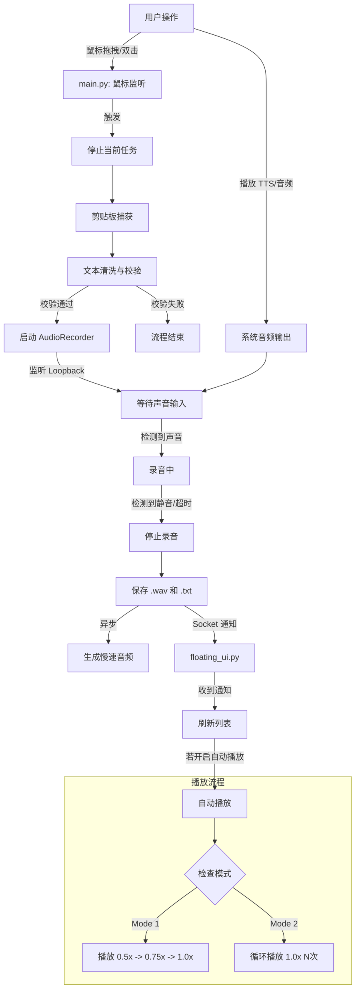

# Project Overview

## 1. 项目文件结构

```
d:\Scanner\2026newReadingI\
├── audio/                      # [运行时生成] 存放录制的音频文件 (.wav)
├── text/                       # [运行时生成] 存放录音对应的文本文件 (.txt)
├── tasks/                      # 任务记录文件夹
│   └── add-pause-and-startup-optimization.md
├── .gitignore                  # Git 忽略文件配置
├── audio_processor.py          # 音频后处理模块 (FFmpeg 变速)
├── audio_recorder.py           # 音频录制模块 (WASAPI Loopback)
├── clipboard_manager.py        # 剪贴板管理模块 (文本捕获)
├── config.ini                  # 配置文件
├── config_loader.py            # 配置加载模块
├── floating_ui.py              # 主 UI 界面模块 (PyQt6 悬浮球)
├── main.py                     # 后台逻辑主入口 (鼠标监听与流程控制)
├── README.md                   # 项目说明文档
├── requirements.txt            # 项目依赖库清单
├── start_app.bat               # 启动脚本 (同时启动 UI 和后台)
└── text_processor.py           # 文本处理模块 (清洗与校验)
```

## 2. 模块职责说明

| 文件名 | 职责说明 |
| :--- | :--- |
| **main.py** | **后台核心逻辑**。负责监听全局鼠标事件（拖拽选词、双击选词），协调剪贴板捕获、文本处理和音频录制的整个流程。同时运行退出服务监听器，响应 UI 的退出指令。 |
| **floating_ui.py** | **前端 UI 界面**。基于 PyQt6 实现悬浮球、播放列表面板、音频播放器、单词排序游戏窗口。负责展示录音列表、播放控制、自动清理旧文件以及接收后台录音完成的通知。 |
| **audio_recorder.py** | **音频录制**。使用 `soundcard` 库进行系统内录（WASAPI Loopback）。实现了基于静音阈值的自动开始/停止录音逻辑，录音完成后保存文件并通知 UI。 |
| **audio_processor.py** | **音频处理**。调用系统 FFmpeg 命令生成慢速音频版本（0.5x, 0.75x）。优先使用高质量的 `rubberband` 滤镜，失败则回退到 `atempo`。 |
| **clipboard_manager.py** | **剪贴板操作**。封装了模拟 Ctrl+C、读取剪贴板、备份与恢复剪贴板内容的逻辑，确保能够获取用户选中的文本而不污染用户剪贴板历史。 |
| **text_processor.py** | **文本处理**。负责对捕获的文本进行合法性校验（长度限制、重复检测）和清洗（仅保留英文字符、数字及特定标点）。 |
| **config_loader.py** | **配置管理**。封装 `configparser`，提供强类型的配置属性访问接口，统一管理 `config.ini` 中的参数。 |

## 3. 核心类和函数清单

### main.py
*   **`class MainApp`**: 应用程序主控制器。
    *   `on_click(x, y, button, pressed)`: 鼠标点击回调，识别拖拽或双击动作。
    *   `handle_trigger()`: 触发选词流程，停止当前任务并启动新线程。
    *   `run_process_flow()`: 核心业务流：捕获剪贴板 -> 处理文本 -> 停止播放 -> 启动录音。
*   **`class ExitServer`**: 线程类，监听 `65433` 端口，接收来自 UI 的退出指令以关闭后台进程。

### floating_ui.py
*   **`class FloatingBall`**: 悬浮球主窗口，处理拖拽移动、展开/收起面板逻辑。
*   **`class ListPanel`**: 音频列表面板，包含模式切换、日期筛选、文件列表渲染。
*   **`class AudioPlayer`**: 播放器逻辑封装，处理播放队列、播放模式（顺序/循环）、自动播放。
*   **`class WordGameWindow`**: 单词还原句子游戏的窗口逻辑。
*   **`class FileScanner`**: 异步线程，扫描 `audio` 目录下的新文件。
*   **`class FileCleaner`**: 后台线程，根据配置定期清理过期的录音文件。
*   **`class CommandServer`**: 线程类，监听 `65432` 端口，接收录音完成通知和停止播放指令。

### audio_recorder.py
*   **`class AudioRecorder`**: 录音线程。
    *   `get_loopback_mic()`: 智能查找默认扬声器对应的 Loopback 设备。
    *   `run()`: 执行录音循环，实时计算分贝值(dB)以检测静音状态。
    *   `save_file()`: 保存音频文件、生成对应的文本文件，并触发慢速音频生成。

### audio_processor.py
*   **`generate_slow_audio(input_path, speeds)`**: 调用 FFmpeg 生成指定倍速的音频副本。

### text_processor.py
*   **`clean_text(text)`**: 正则表达式清洗文本，仅保留 `[a-zA-Z0-9\s\-’—$,.?]`。
*   **`validate_text(text, last_text)`**: 校验文本长度（<=600）及是否重复。

## 4. config.ini 配置参数说明

### [Audio] (录音设置)
*   `start_silence_duration`: 开始录音前的最大静音等待时间（秒）。
*   `max_recording_duration`: 最大录音时长（秒）。
*   `silence_threshold_db`: 静音阈值（分贝），低于此值视为静音。
*   `end_silence_duration`: 尾部静音检测时长（秒），持续静音超过此时间停止录音。

### [Paths] (路径设置)
*   `save_dir`: 音频文件保存目录名。

### [UI] (界面设置)
*   `ball_diameter`: 悬浮球直径。
*   `panel_width`, `panel_max_height`: 列表面板的宽和最大高。
*   `opacity`: 界面不透明度。
*   `animation_duration`: 动画持续时间（毫秒）。
*   `font_size`, `text_color`: 列表项字体大小和颜色。
*   `play_button_*`: 播放按钮在不同状态下的颜色配置。
*   `refresh_interval`: 列表自动刷新间隔（毫秒）。
*   `last_position`: 记忆悬浮球上次所在的位置坐标。
*   `*_width`, `*_height`: 顶部栏各控件的尺寸配置。

### [PlayMode] (播放模式)
*   `last_mode`: 记忆上次使用的播放模式 (`mode1`: 渐进式, `mode2`: 循环)。
*   `mode2_loop_count`: 模式2下的循环次数。
*   `auto_enabled`: 是否开启录音后自动播放。

### [SlowAudio] (变速处理)
*   `generate_slow_versions`: 是否生成慢速版本。
*   `slow_speeds`: 需要生成的慢速倍率列表（如 `0.5, 0.75`）。

### [WordGame] (游戏设置)
*   `min_text_length`: 触发游戏所需的最小文本长度。
*   `text_folder`: 文本文件保存目录。
*   `clickable_text_color`: 可玩游戏的列表项高亮颜色。
*   `game_window_width/height`: 游戏窗口尺寸。

### [ContextMenu] (右键菜单)
*   `bg_color`, `text_color`, `border_color`: 右键菜单样式配置。

### [DateFilter] (日期筛选)
*   `max_display_dates`: 列表保留的最大日期数量（用于清理逻辑）。
*   `cleanup_delay_seconds`: 启动后延迟多久开始执行清理任务。

## 5. 程序主要工作流程



## 6. 依赖库清单 (requirements.txt)

```text
pynput        # 鼠标键盘监听与控制
pyperclip     # 剪贴板操作
soundcard     # 音频录制 (WASAPI)
soundfile     # 音频文件读写
numpy         # 音频数据处理
pywin32       # Windows API 调用
PyQt6         # 图形用户界面
```

## 7. 技术实现细节

1.  **WASAPI Loopback 录音**:
    *   使用 `soundcard` 库获取系统的 Loopback 设备（即“立体声混音”或“内录”），能够录制系统发出的任何声音，而不需要物理麦克风。
    *   通过 `sc.all_microphones(include_loopback=True)` 并匹配默认扬声器名称来定位正确的 Loopback 设备。

2.  **FFmpeg 变速处理**:
    *   通过 `subprocess` 调用系统安装的 `ffmpeg` 命令行工具。
    *   **Rubberband 滤镜**: 优先使用 `rubberband=tempo=X`，它在调整速度时能提供极高的时间拉伸质量，保持音高不变且伪影较少。
    *   **Atempo 滤镜**: 作为备选方案 (`atempo=X`)，如果系统未安装 rubberband 库，则使用标准的 atempo 滤镜。

3.  **进程间通信 (IPC)**:
    *   程序分为两个主要部分运行：后台逻辑 (`main.py`) 和 UI (`floating_ui.py`)。
    *   **Socket 65432**: UI 作为 Server，后台作为 Client。当录音完成时，后台发送文件路径给 UI；后台开始录音时，发送 `STOP_PLAYBACK` 指令给 UI 停止当前播放。
    *   **Socket 65433**: 后台作为 Server，UI 作为 Client。当用户在 UI 退出程序时，UI 发送 `EXIT` 指令给后台，确保所有进程优雅退出。

4.  **剪贴板无感捕获**:
    *   在执行 Ctrl+C 之前，先备份用户当前的剪贴板内容。
    *   执行捕获后，延迟一小段时间将剪贴板恢复为原内容，使得整个选词过程对用户的剪贴板历史影响最小化。

5.  **单词还原游戏算法**:
    *   将句子 Tokenize（分词）为单词列表。
    *   使用随机洗牌算法打乱单词顺序，并确保打乱后的顺序与原句不同（如果可能）。
    *   用户通过点击单词将其在“待选区”和“已选区”之间移动，最终比对已选区的单词序列与原句是否一致。
