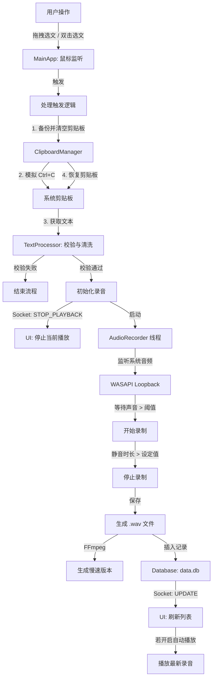

# Project Overview

## 1. 项目文件结构

```
d:\Scanner\2026newReadingI\
├── styles/                  # QSS 样式文件目录
│   └── review_window.qss    # 复习窗口样式
├── tasks/                   # 任务记录目录
├── audio_processor.py       # 音频处理模块 (FFmpeg 变速)
├── audio_recorder.py        # 音频录制模块 (WASAPI Loopback)
├── clipboard_manager.py     # 剪贴板管理模块
├── config.ini               # 配置文件
├── config_loader.py         # 配置加载模块
├── data.db                  # SQLite 数据库文件
├── db_manager.py            # 数据库管理模块
├── floating_ui.py           # 主 UI 模块 (悬浮球、列表、播放器)
├── main.py                  # 后台主程序 (鼠标监听、流程控制)
├── requirements.txt         # 依赖库清单
├── start_app.bat            # 启动脚本
├── style_manager.py         # 样式管理模块
└── text_processor.py        # 文本处理模块
```

## 2. 模块职责说明

| 文件名 | 职责描述 |
| :--- | :--- |
| **main.py** | 程序的后台入口。负责全局鼠标监听（拖拽/双击触发），协调剪贴板读取、文本处理和录音流程的启动与停止。 |
| **floating_ui.py** | 程序的前端 UI 入口。实现悬浮球、录音列表面板、音频播放器、复习窗口 (`ReviewWindow`) 和单词游戏 (`WordGameWindow`)。 |
| **audio_recorder.py** | 负责音频录制。使用 WASAPI Loopback 录制系统声音，包含静音检测逻辑（开始/结束静音判定），并负责调用音频处理和数据库保存。 |
| **audio_processor.py** | 音频后处理工具。调用 FFmpeg 生成慢速版本的音频文件（使用 `rubberband` 或 `atempo` 滤镜）。 |
| **db_manager.py** | 数据库抽象层。封装 SQLite 操作，管理录音记录的增删查改，处理数据库连接和事务。 |
| **config_loader.py** | 配置管理。负责读取 `config.ini`，提供类型安全的配置项访问属性。 |
| **clipboard_manager.py** | 剪贴板操作。负责模拟 Ctrl+C 获取选中文本，并实现了剪贴板内容的备份与恢复机制，减少对用户剪贴板的干扰。 |
| **text_processor.py** | 文本清洗与校验。负责过滤非英文字符，校验文本长度和有效性。 |
| **style_manager.py** | 样式管理。负责加载 `.qss` 样式文件，支持热重载。 |

## 3. 核心类与函数清单

### main.py
*   **`MainApp`**: 主应用类。
    *   `on_click(x, y, button, pressed)`: 鼠标点击回调，检测拖拽和双击事件。
    *   `handle_trigger()`: 触发处理流程（停止旧任务，启动新流程）。
    *   `run_process_flow()`: 核心工作流：剪贴板获取 -> 文本校验 -> 停止播放 -> 启动录音。
*   **`ExitServer`**: 监听 socket 端口，接收退出信号以关闭后台进程。

### audio_recorder.py
*   **`AudioRecorder` (Thread)**: 录音线程类。
    *   `get_loopback_mic()`: 获取系统默认扬声器的 Loopback 设备。
    *   `run()`: 执行录音循环，计算 RMS dB 值进行静音检测。
    *   `save_file()`: 录音结束后的处理（归一化、填充静音）和保存。

### audio_processor.py
*   **`generate_slow_audio(input_path, speeds)`**: 调用系统 FFmpeg 生成指定倍速的音频文件。

### floating_ui.py
*   **`FloatingBall` (QWidget)**: 悬浮球主窗口，负责初始化数据库、一致性检查和启动 Socket 服务。
*   **`ListPanel` (QWidget)**: 录音列表面板，包含日期筛选和列表展示。
*   **`AudioPlayer` (QObject)**: 音频播放控制器，管理播放队列、播放模式（循环/顺序）和音频输出。
*   **`ReviewWindow` (QWidget)**: 单词复习窗口，提供"记得/不记得"交互。
*   **`WordGameWindow` (QWidget)**: 单词拼句游戏窗口。
*   **`ConsistencyChecker` (QThread)**: 启动时检查数据库记录与磁盘文件的一致性。

### db_manager.py
*   **`DatabaseManager`**:
    *   `insert_recording(...)`: 插入新录音记录。
    *   `get_recordings_by_date(...)`: 按日期查询录音。
    *   `delete_recording(...)`: 删除录音记录。

## 4. config.ini 配置参数说明

### [Audio] - 录音设置
*   `start_silence_duration`: 开始录音前允许的最大静音时长（秒），超时则放弃。
*   `max_recording_duration`: 最大录音时长（秒）。
*   `silence_threshold_db`: 静音阈值（dB），低于此值视为静音。
*   `end_silence_duration`: 录音过程中，持续静音多少秒后自动停止。

### [Paths] - 路径设置
*   `save_dir`: 音频文件保存目录（默认为 `audio`）。

### [UI] - 界面基础设置
*   `ball_diameter`: 悬浮球直径。
*   `panel_width`: 列表面板宽度。
*   `panel_max_height`: 列表面板最大高度。
*   `opacity`: 窗口透明度。
*   `font_size`: 基础字体大小。
*   `refresh_interval`: 列表自动刷新间隔（毫秒）。
*   `last_position`: 悬浮球上次退出时的位置。

### [PlayMode] - 播放模式
*   `default_mode`: 默认播放模式。
*   `mode2_loop_count`: Mode2 下的单曲循环次数。
*   `auto_enabled`: 是否开启录音完成后自动播放。

### [SlowAudio] - 慢速音频
*   `generate_slow_versions`: 是否生成慢速版本。
*   `slow_speeds`: 需要生成的慢速倍率列表（如 `0.5, 0.75`）。

### [WordGame] - 单词游戏
*   `min_text_length`: 触发游戏功能的最小文本长度。
*   `game_window_width` / `game_window_height`: 游戏窗口尺寸。

### [Database] - 数据库
*   `db_path`: 数据库文件路径。
*   `wal_mode`: 是否开启 WAL 模式（提高并发性能）。

*(注：ReviewWindow, ContextMenu, DateFilter 等节包含具体的 UI 颜色、尺寸和布局配置，在此不一一列举)*

## 5. 程序主要工作流程



## 6. 依赖库清单 (requirements.txt)

*   `pynput`: 用于监听鼠标事件和模拟键盘按键。
*   `pyperclip`: 用于跨平台的剪贴板读写操作。
*   `soundcard`: 用于音频录制（支持 WASAPI Loopback）。
*   `soundfile`: 用于读写 WAV 音频文件。
*   `numpy`: 用于音频数据处理（RMS 计算、归一化、数组拼接）。
*   `pywin32`: 提供了 Windows API 的访问（虽然代码中直接引用较少，可能是 soundcard 或其他库的依赖）。
*   `PyQt6`: 用于构建图形用户界面。

## 7. 技术实现细节

1.  **WASAPI Loopback 录音**:
    *   使用 `soundcard` 库获取默认扬声器的 Loopback 设备，从而录制系统内部发出的声音（如 TTS 发音），而非麦克风声音。
    *   通过计算音频块的 RMS（均方根）并转换为 dB 值来实现基于阈值的静音检测。

2.  **FFmpeg 变速处理**:
    *   调用系统安装的 `ffmpeg` 命令行工具。
    *   优先尝试 `rubberband` 滤镜（音质更好），如果失败则回退到 `atempo` 滤镜。
    *   生成的文件名格式为 `{number}@{speed}.wav`。

3.  **剪贴板无感操作**:
    *   在捕获文本前，先读取当前剪贴板内容并保存。
    *   执行捕获后，延时将原内容写回剪贴板，尽量减少对用户正常复制粘贴操作的干扰。

4.  **双进程架构**:
    *   **后台进程 (`main.py`)**: 负责由于权限或稳定性原因更适合独立运行的输入监听和录音任务。
    *   **UI 进程 (`floating_ui.py`)**: 负责界面展示。
    *   **通信**: 两个进程通过本地 Socket (`127.0.0.1:65432` 和 `65433`) 进行简单的信号通信（如停止播放、刷新列表、退出程序）。

5.  **数据一致性维护**:
    *   UI 启动时会运行 `ConsistencyChecker`，比对数据库记录和磁盘上的 `.wav` 文件。
    *   自动删除没有对应文件的数据库记录，或没有对应数据库记录的孤儿文件，保持数据整洁。
